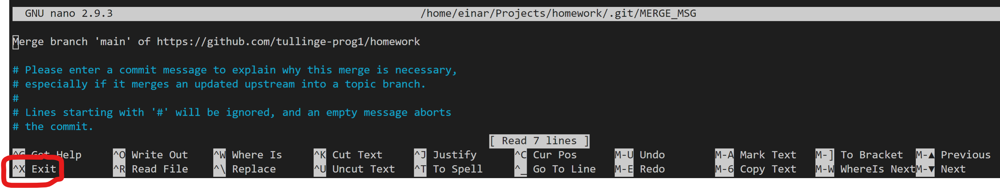

# Homework

## Första gången

1. Gör en fork av detta repository.
2. Lägg till **detta** repository som en ny remote, så att du kan dra ner nya läxuppgifter varje vecka. Skriv enligt nedan

````
    git remote add upstream https://github.com/tullinge-prog1/homework.git
````

**Om du har några problem med att komma igång - säg till**. 

## Varje vecka

1. Kör `git pull upstream main` för att få ner denna veckas läxor. Du kommer kanske att se en texteditor i terminalen när ändringarna från båda repositories ska mergas (sättas ihop). Det är helt OK. Tryck `CTRL X` (ibland kan du även behöva trycka `Y` efteråt för att bekräfta).

2. Gör uppgifterna
3. Pusha upp efter varje löst uppgift.

Om du har problem med någon av uppgifterna är det **ditt ansvar** att prata med din grupp eller komma på studiepass för att få hjälp.
